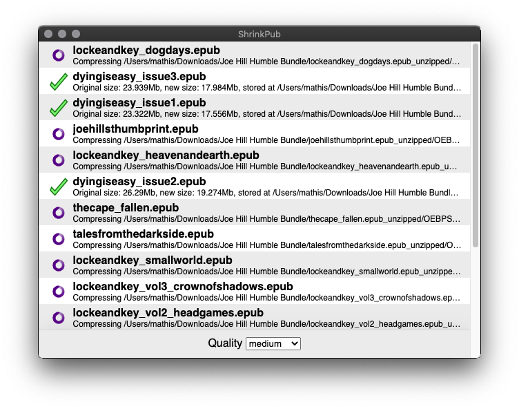

# ShrinkPub
Electron Epub compression tool. Open the app, select your compression level, drag some epub files into the window, and Bob's your uncle. App will not overwrite or delete anything, and will temp folders behind that you should probably delete.

# Clone this repository
git clone https://github.com/L-K-M/ShrinkPub
# Go into the repository
cd ShrinkPub
# Install dependencies
npm install
# Run the app
npm start

