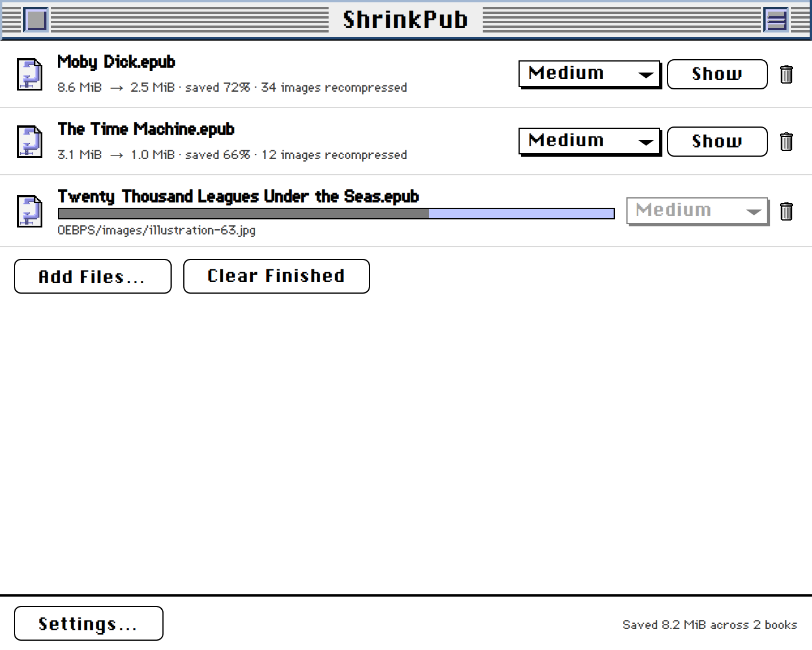

# ShrinkPub

ShrinkPub is a Tauri desktop app that makes EPUB files smaller: drop your books
into the window, pick a quality tier, and each one gets a recompressed
`Book (shrunk).epub` sibling. Originals are never modified, images are only
replaced when the recompressed version is actually smaller, and nothing is ever
left behind on disk — the whole book is repacked in memory.

**Latest release:** v<!-- version -->2.0.0<!-- /version --> · [Download](https://github.com/L-K-M/ShrinkPub/releases/latest)



> [!IMPORTANT]
> LLM Disclosure: This project was developed with the assistance of large language models (AI coding tools).

## Installation

```bash
# Clone the repository
git clone https://github.com/L-K-M/ShrinkPub.git
cd ShrinkPub

# Install dependencies
npm install

# Run in development mode
npm run tauri dev

# Build for production
npm run tauri build
```

The built bundles land in `src-tauri/target/release/bundle/`.

## Command line

The same engine ships as a CLI for batch use:

```bash
cargo run -p shrinkpub-cli -- --quality low Book1.epub Book2.epub
```

## How it shrinks

EPUBs are zip containers whose weight is almost entirely JPEG/PNG payload.
ShrinkPub re-encodes JPEGs at the tier's quality, palette-quantizes PNGs, and
downscales oversized images at the lower tiers — then keeps whichever version
is smaller, byte for byte. Everything else in the book is copied through
untouched, and the output container is OCF-compliant (`mimetype` first, stored)
even when the source wasn't. See [MODERNIZATION.md](./MODERNIZATION.md) for the
full design (and the audit of the Electron app this replaced).
